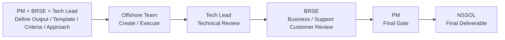
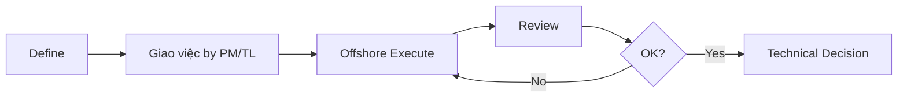
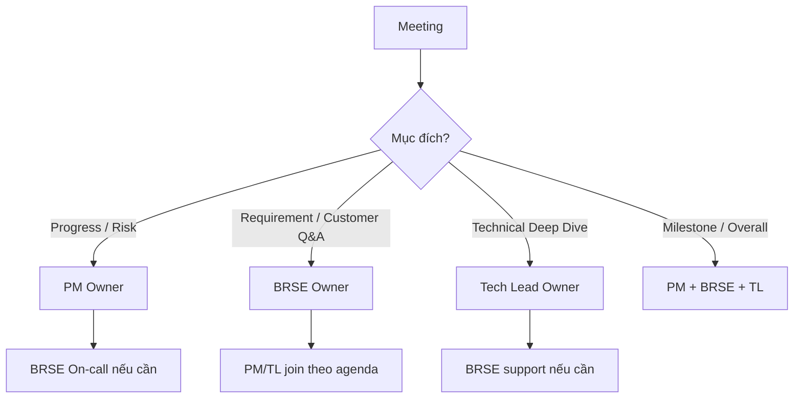
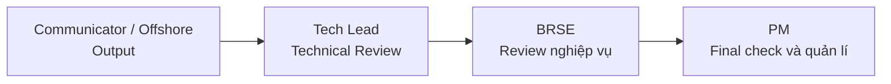
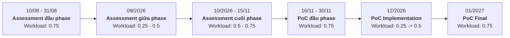
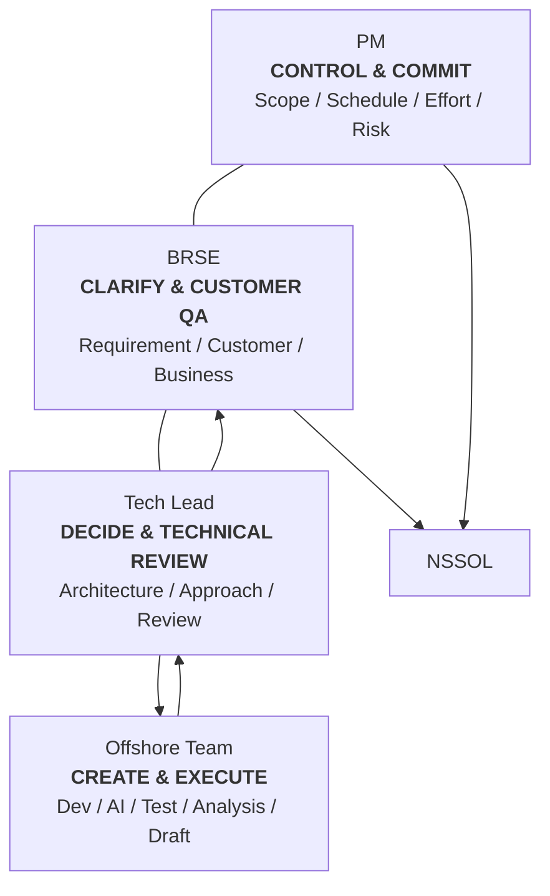

> # **Phân định vai trò PM – BRSE – Tech Lead**

## Project Assessment & PoC Migration C/Pro\*C → C#

## 1. Mục đích

Mục tiêu của việc phân định vai trò không phải để tạo ranh giới cứng giữa PM, BRSE và Tech Lead, mà để:

- Tránh duplicate effort.
- Tránh nhiều người cùng làm/review một việc.
- Xác định ai là người hợp lí nhất
- Senior/onsite resource tập trung vào decision, review, communication và risk.
- Một task phải xác định rõ ai là Owner, ai thực thi, ai review và ai giao tiếp với khách hàng.

# 25. Một câu chốt

> **Mục tiêu không phải là "đây không phải việc của tôi".
> Mục tiêu là "người phù hợp nhất làm việc đó với tổng effort thấp nhất".**

---

# 2. Nguyên tắc vận hành chung

> **1 task = 1 Owner**

Các role khác chỉ tham gia dưới dạng:

- **Executor**: người trực tiếp tạo output.
- **Reviewer**: người kiểm tra theo chuyên môn của mình.
- **Support**: hỗ trợ khi cần.
- **Customer Interface**: người giao tiếp/xác nhận với NSSOL.

### Nguyên tắc quan trọng

> **Nếu offshore làm được thì offshore làm.**
> **Nếu Dev/Tester/AI Dev tự communicate được thì BRSE không cần chen vào.**
> **Nếu output chỉ cần technical review thì chỉ Tech Lead review.**
> **PM/BRSE/TL không cần cùng review tất cả output.**

---

# 3. Vai trò cốt lõi

| Role              | Trách nhiệm cốt lõi                                                                       | Keyword                       |
| ----------------- | ----------------------------------------------------------------------------------------- | ----------------------------- |
| **PM**            | Scope, Schedule, Resource, Effort, Risk, Reporting, Commitment                            | **Control & Commit**          |
| **BRSE**          | Customer communication, Requirement clarification, Business/Document QA, Review nghiệp vụ | **Clarify & Customer QA**     |
| **Tech Lead**     | Technical direction, Technical decision, Technical review                                 | **Decide & Technical Review** |
| **Offshore Team** | Analysis, Coding, Testing, AI, Document Draft, Data Collection                            | **Create & Execute**          |

---

# 4. Mô hình làm việc tổng thể



### Tư tưởng

Không phải output nào cũng chạy qua cả PM + BRSE + TL.

Ví dụ:

```text
Technical internal output
Dev → Tech Lead → Done
```

## Ý nghĩa từng bước

### 1. PM + BRSE + Tech Lead cùng define trước

- Xác định output cần tạo.
- Thống nhất template sử dụng.
- Thống nhất quan điểm đánh giá / tiêu chí đánh giá.
- Xác định scope.
- Thống nhất technical approach.
- Thống nhất customer / business expectation.

### 2. Offshore Team thực thi

- Analysis.
- Coding.
- Testing.
- AI implementation / tuning.
- Data collection.
- Draft document.
- Tạo deliverable theo template và tiêu chí đã thống nhất.

### 3. Tech Lead – Technical Review

- Kiểm tra technical correctness.
- Review architecture / approach.
- Review migration quality.
- Kiểm tra technical consistency.
- Xác định technical risk.
- Yêu cầu offshore sửa nếu chưa đạt.

### 4. BRSE – Business / Customer Review

- Kiểm tra output có đúng requirement hay không.
- Kiểm tra có đúng customer expectation hay không.
- Kiểm tra nội dung có dễ hiểu đối với NSSOL hay không.
- Kiểm tra terminology / document consistency.
- Kiểm tra wording có gây hiểu nhầm hay over-commit hay không.
- Xác nhận các điểm cần clarify lại với NSSOL nếu có.

### 5. PM – Final Gate

- Kiểm tra scope.
- Kiểm tra schedule.
- Kiểm tra effort.
- Kiểm tra commitment.
- Kiểm tra deliverable completeness.
- Xác nhận output đã đủ điều kiện để gửi NSSOL hay chưa.

---

# 5. Phạm vi trách nhiệm của PM

## PM chịu trách nhiệm

- Project Plan / WBS
- Schedule / Milestone
- Resource
- Cost / Effort
- Progress
- Risk / Issue
- Dependency
- Scope
- Change Control
- Deliverable Tracking
- Project Reporting
- Escalation
- Overall Estimation
- Final Project Commitment

## PM không cần làm

- Source code analysis.
- Technical design.
- Technical implementation.
- Review chi tiết code.
- Viết lại technical report thay Tech Lead/Dev.
- Clarify từng requirement nghiệp vụ nhỏ với NSSOL.
- Review xem đúng nghiệp vụ chưa , hay khách hàng có muốn đúng cái đó ko

### PM tập trung vào câu hỏi

> **Có làm đúng scope không?**
> **Có kịp schedule không?**
> **Effort có đúng không?**
> **Có risk gì không?**
> **Project có thể commit điều này không?**

---

# 6. Phạm vi trách nhiệm của BRSE

## BRSE chịu trách nhiệm

### Customer Communication và expectation

- Đầu mối communication với NSSOL.
- Requirement clarification.
- Q&A.
- Clear expected output là gì
- Quản lí tất cả Customer expectation .

### Business review là làm cái gì?

Kiểm tra:

- Output có đúng điều NSSOL yêu cầu không?
- Có thiếu business/customer context không?
- Có wording nào khiến NSSOL hiểu sai không?
- Technical result có hiểu được hay ko
- Có assumption nào cần nói rõ không?

### Đảm bảo chất lượng Document

- Japanese wording.
- Terminology.
- Glossary consistency.
- Customer-facing structure.
- Readability.
- Consistency giữa các tài liệu.

## BRSE không phải

- Technical reviewer.
- Tester.
- Technical analyst mặc định.
- Document creator mặc định ( có thể hỗ trợ khi cần thiết ).
- Translator full-time cho internal team.
- Không cần tham gia các meeting nếu ko có liên quan.

### Nguyên tắc BRSE

> **Không hỏi "BRSE có làm được việc này không?"**

Mà hỏi:

> **"Việc này có bắt buộc BRSE phải làm không?"**

Nếu offshore hoặc TL làm được mà không cần customer/business context:

> **Không cần BRSE, chỉ CC để follow cùng nếu có time**

# 7. Phạm vi trách nhiệm của Tech Lead

## Tech Lead chịu trách nhiệm

- Technical methodology.
- Architecture.
- Assessment approach.
- Migration strategy.
- C/Pro\*C → C# technical direction.
- AI / Knowledge Base technical direction.
- Technical criteria.
- Technical estimation assumptions.
- Technical task breakdown.
- Technical decision.
- Technical review.
- Technical risk.
- Technical blocker resolution.

## Tech Lead không phaỉ là Senior Developer full-time

Workflow:



Không phải:

```text
Define
↓
Tự implement
↓
Tự test
↓
Tự viết report
↓
Tự sửa
```

Tech Lead phải là người review và chịu trách nhiệm kĩ thuật cho offshore team.

---

# 8. Quy tắc giao tiếp với NSSOL

BRSE ko nhất định phải là Communicate point chính

> Bất cứ ai có khả năng nên nói chuyện trực tiếp với NSSOL.

Cách vận hành hợp lý hơn:

| Nội dung                                    | Owner            |
| ------------------------------------------- | ---------------- |
| Requirement / nghiệp vụ / specification     | **BRSE**         |
| Scope / schedule / resource / project issue | **PM**           |
| Technical deep dive                         | **Tech Lead**    |
| Official customer communication flow        | **BRSE quản lý** |

### Ví dụ

NSSOL hỏi:

> Pro\*C dynamic SQL này định migrate sang C# thế nào?

→ **Tech Lead trả lời trực tiếp.**

NSSOL hỏi tiếp:

> Vậy approach này sẽ áp dụng cho toàn bộ 400 chức năng đúng không?

→ Đây không còn là technical question đơn thuần.

> Cần CC BRSE/PM incharge để tránh accidental commitment.

---

# 9. Quy tắc Review

## Không áp dụng

```text
Output
 ↓
PM review
 ↓
BRSE review
 ↓
Tech Lead review
 ↓
Sửa
 ↓
Cả 3 review lại
```

Đây là duplicate effort.

---

## Áp dụng review theo domain

| Loại Review                                      | Owner         |
| ------------------------------------------------ | ------------- |
| Technical correctness                            | **Tech Lead** |
| Code / architecture / migration quality          | **Tech Lead** |
| Business review                                  | **BRSE**      |
| Japanese / Độ dễ hiểu / Chuẩn hóa theo checklist | **BRSE**      |
| Scope / schedule / effort                        | **PM**        |
| Final external commitment                        | **PM**        |

---

---

# 10. Meeting Structure

## Daily

### Mục đích

- Progress.
- Blocker.
- Short-term risk.

### Thành phần

- **PM: chủ trì**
- Tech Lead
- Dev / Tester / AI Dev liên quan
- **BRSE: On-call**

BRSE chỉ cần tham gia khi:

1. Có issue đang chờ NSSOL.
2. Có requirement cần clarification.
3. Có business/customer risk nóng.
4. PM/TL cần BRSE cho một agenda cụ thể.

### Nguyên tắc

> **BRSE không tham gia daily meeting nếu ko cần thiết !**

---

## Weekly Progress Meeting

### Owner

**PM**

### Nội dung

- Progress.
- Milestone.
- Risk.
- Issue.
- Resource.
- Next week plan.

### Thành phần

- PM
- Tech Lead
- BRSE

Mỗi người chỉ update phần mình.

Không biến weekly thành technical deep dive.

---

## Requirement / Customer Q&A Meeting

### Owner

**BRSE**

### Nội dung

- Requirement clarification.
- NSSOL Q&A.
- Data/document request.
- Expected output.
- Business rules.
- Customer decision.

PM/TL chỉ join khi agenda liên quan.

---

## Technical Meeting

### Owner

**Tech Lead**

### Nội dung

- Architecture.
- Migration pattern.
- DB.
- AI.
- Conversion.
- Technical blocker.

BRSE join nếu cần:

- translation;
- Xác định customer context;
- tránh misunderstanding.
- Có khả năng thay đổi về expected output trong cuộc họp

---

## Monthly / Milestone Review ( Nội bộ xong đến customer )

### Owner

**PM**

### Thành phần

**PM + BRSE + Tech Lead**

### Nội dung

- Milestone.
- Major findings.
- Risk.
- Overall assessment.
- Customer decision.
- Next phase.

---

# 11. Meeting Map



---

# 12. Reporting

| Loại Report           | Owner                            | Vai trò khác                  |
| --------------------- | -------------------------------- | ----------------------------- |
| Internal Progress     | **PM**                           | TL + BRSE cung cấp input      |
| Risk / Issue Report   | **PM**                           | TL/BRSE input                 |
| NSSOL Progress Report | **PM**                           | BRSE customer QA/presentation |
| Technical Metrics     | **Tech Lead / Offshore prepare** | PM sử dụng                    |
| Productivity Report   | **PM**                           | TL technical input            |
| Estimation Model      | **PM Overall Owner**             | TL technical assumptions      |

### Nguyên tắc

> > PM tổng hợp official project reporting.

> > TL và BRSE cung cấp input theo domain.

---

# 13. Assessment – Task #10

## Document Update Policy

| Role                    | Responsibility                |
| ----------------------- | ----------------------------- |
| Communicator / Offshore | **Draft / Analysis / Create** |
| Tech Lead               | **Technical Review**          |
| BRSE                    | **Customer / Document QA**    |
| PM                      | **Scope Check**               |

### BRSE không làm

- Viết mới design

### BRSE làm

- Review sản phẩm xem đáp ứng đủ nghiệp vụ chưa.
- Define tiêu chuẩn , checklist, template để thực hiện update
- Check NSSOL expectation.
- Check customer readability.
- Clarify ambiguous point với NSSOL.

Flow:



---

# 14. Assessment – Task #11

## Glossary / Translation Memory

| Role            | Responsibility                           |
| --------------- | ---------------------------------------- |
| Communicator    | **Create Glossary / Translation Memory** |
| Dev / Tech Lead | Technical terminology support            |
| BRSE            | **QA + NSSOL Confirmation**              |
| PM              | Informed                                 |

### BRSE tập trung vào

- Ambiguous terminology.
- Railway/domain terminology.
- NSSOL-specific wording.
- Consistency.
- Term cần customer confirmation.

---

# 15. Assessment – Task #12

---

## BRSE Workload Timeline



# 16. Workload BRSE

Nên define:

> **BRSE allocation dựa trên workload thực tế của phase.**

---

## Assessment đầu phase và cuối phase : 0.75

Communication / clarification nhiều.

BRSE workload có thể cao hơn:

- Input clarification.
- Document request.
- NSSOL interview giai đoạn đầu cần rất nhiều và rất rõ .
- Environment.
- Glossary.
- Requirement.
- Assessment criteria.

---

## Assessment giữa phase: 0.25 -> 0.5

Technical analysis chạy mạnh.

Workload chính chuyển sang:

- Dev.
- AI Dev.
- Tester.
- Tech Lead.

BRSE workload tự nhiên giảm.

---

## PoC đầu phase : 0.75

BRSE tăng lại do:

- Clear quan điểm cho round2 round3
- Lấy test data.
- Quản lí Expected output.
- Các vấn đề Environment khả năng sẽ có phát sinh trong giai đoạn đầu
- Các tiêu chí nghiệm thu chưa được làm rõ.

---

## PoC Implementation : 0.25

Dev/TL/Tester/AI Dev là lực lượng chính.

BRSE chỉ xử lý:

- Customer Q&A.
- Công việc bị thuộc ( như take dữ liệu hệ thống cũ)
- Customer-facing / QA.

---

## PoC Final: 0.75

BRSE tăng lại do:

- Final report.
- Customer presentation.
- Migration proposal.
- Customer QA.

---

# 17. BRSE Daily Workload Example

Một ngày không có issue có thể chỉ là:

```text
09:00  Check Issue / Action list
09:15 - 12:00 : check issue, trả lời QA , QA hỏi khách, quản lý các loại , expectation, daily call sync thông tin với offshore
      ↓
Done 1 ngày work , còn lại buổi chiều chỉ là follow

13:00 - 14:00 : daily meeting NSSOL ( join cho vui)
14:00 - 15:00 : review sản phẩm nếu có
15:00 trở đi Follow-up ISSUE/QA
      ↓
Done
```

---

# 18. Anti-pattern cần tránh

## Anti-pattern 1 – Cả 3 cùng làm

```text
PM
BRSE     → cùng investigate một issue
TL
```

### Nên

```text
Customer issue → BRSE
Technical issue → TL
Project issue → PM
```

---

## Anti-pattern 2 – BRSE viết lại output

```text
Dev Analyze
   ↓
Explain cho BRSE
   ↓
BRSE học lại technical context
   ↓
BRSE viết document
   ↓
TL review lại
```

### Nên

```text
Dev Analyze + Draft
   ↓
TL Technical Review
   ↓
BRSE Customer QA
```

---

## Anti-pattern 3 – 3 người cùng review

```text
Output
↓
TL review
↓
BRSE review toàn bộ
↓
PM review toàn bộ
```

### Nên

```text
Technical → TL
Business/Customer → BRSE
Scope/Effort → PM
```

---

## Anti-pattern 4 – BRSE thành translator full-time

Nếu:

- TL ↔ Dev tự nói được.
- NSSOL Engineer ↔ TL tự trao đổi technical được.

→ Cho họ nói trực tiếp.

BRSE chỉ tham gia khi:

- misunderstanding;
- requirement implication;
- customer commitment;
- Japanese communication cần support.

---

# 19. Decision Matrix

| Question                                       | Người quyết      |
| ---------------------------------------------- | ---------------- |
| Làm technical approach nào?                    | **Tech Lead**    |
| Architecture nào?                              | **Tech Lead**    |
| Output technical có đúng không?                | **Tech Lead**    |
| NSSOL thực sự muốn gì?                         | **BRSE clarify** |
| Nội dung gửi NSSOL có dễ hiểu không?           | **BRSE**         |
| Requirement/customer expectation đã đúng chưa? | **BRSE**         |
| Có nằm trong scope không?                      | **PM**           |
| Có đủ resource không?                          | **PM**           |
| Có kịp schedule không?                         | **PM**           |
| Có commit với NSSOL được không?                | **PM**           |

---

# 22. Tóm tắt một trang

## PM

> **CONTROL & COMMIT**

- Scope
- Schedule
- Effort
- Resource
- Risk
- Reporting
- Commitment

---

## BRSE

> **CLARIFY & CUSTOMER QA**

- NSSOL Communication
- Requirement
- Business Context
- Customer Expectation
- Document QA
- Customer-facing QA

---

## Tech Lead

> **DECIDE & TECHNICAL REVIEW**

- Architecture
- Technical Approach
- Technical Decision
- Technical Risk
- Technical Review
- Technical Direction

---

## Offshore

> **CREATE & EXECUTE**

- Analyze
- Code
- AI
- Test
- Collect Data
- Draft Document
- Prepare Metrics

---

# 23. Mô hình cuối cùng muốn thống nhất



---

# 24. Nội dung muốn thống nhất trong buổi họp

Cuối buổi PM + BRSE + Tech Lead cần agree ít nhất các điểm sau:

- [ ] 1 task chỉ có 1 Owner.
- [ ] Offshore tạo output tối đa có thể, cắt giảm efford onsite.
- [ ] Tech Lead không ôm implementation nếu offshore làm được.
- [ ] BRSE không làm technical task chỉ để fill resource.
- [ ] BRSE không phải translator full-time.
- [ ] PM là owner của quản lí project / resourcing/ reporting.
- [ ] BRSE là owner của requirement/customer communication.
- [ ] Tech Lead là owner của technical decision/review.
- [ ] Không bắt buộc cả 3 review mọi output.
- [ ] Review được chia theo domain.
- [ ] BRSE Daily = on-call, không mandatory.
- [ ] Technical internal output không cần PM/BRSE review.
- [ ] BRSE Review nghiệp vụ/ đúng cái NSSOL muốn hay chưa.
- [ ] Scope/commitment impact mới cần PM final gate.

---

### Team Operating Model

**Offshore → Create & Execute**
**Tech Lead → Decide & Technical Review**
**BRSE → Clarify & Customer QA**
**PM → Control & Commit**
