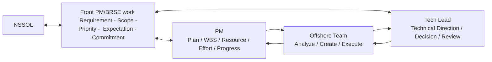
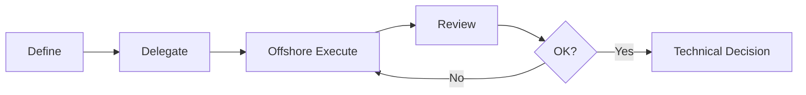
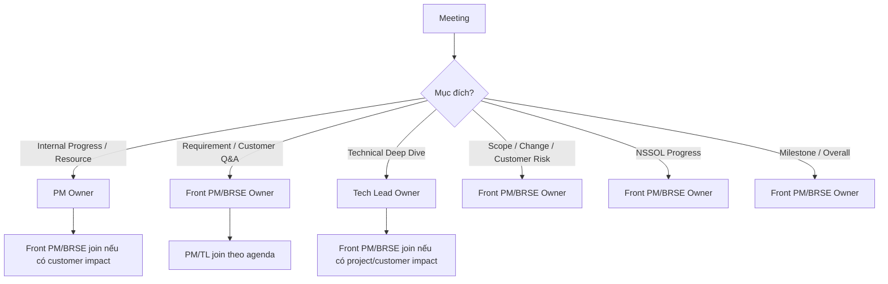
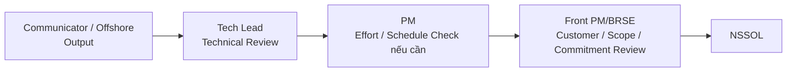
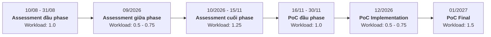
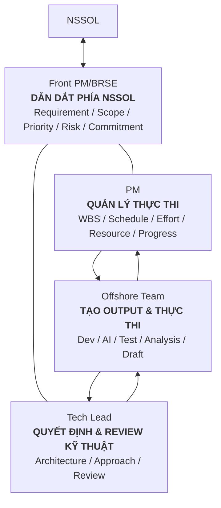

# Phân định vai trò PM – Front PM/BRSE – Tech Lead

## Project Assessment & PoC Migration C/Pro\*C → C#

## 1. Mục đích

Mục tiêu của việc phân định vai trò không phải để tạo ranh giới cứng giữa PM, Front PM/BRSE và Tech Lead, mà để:

- Tránh trùng lặp công việc.
- Tránh nhiều người cùng quản lý hoặc cùng review một việc.
- PM tập trung vào quản lý tổng thể nội bộ: kế hoạch, nguồn lực, chi phí, tiến độ.
- Front PM/BRSE đứng phía trước khách hàng, chịu trách nhiệm điều phối project với NSSOL: yêu cầu, phạm vi, ưu tiên, kỳ vọng, rủi ro, quyết định và cam kết.
- Tech Lead tập trung vào định hướng, quyết định và chất lượng kỹ thuật.
- Một task phải xác định rõ ai là Owner, ai thực thi, ai review, ai quyết định và ai giao tiếp với khách hàng.

---

# 24. Một câu chốt

> **Nếu là BRSE thuần: trọng tâm là làm rõ NSSOL muốn gì.**
>
> **Nếu là Front PM/BRSE: ngoài việc làm rõ NSSOL muốn gì, còn phải chịu trách nhiệm dẫn dắt cách project đáp ứng yêu cầu đó — scope nào, ưu tiên nào, risk gì, thay đổi ra sao và project có thể cam kết điều gì.**

### Team Operating Model

**Offshore → Tạo output & Thực thi**
**Tech Lead → Quyết định & Review kỹ thuật**
**PM → Quản lý thực thi nội bộ**
**Front PM/BRSE → Dẫn dắt project phía NSSOL**

---

# 2. Nguyên tắc vận hành chung

> **1 task = 1 Owner**

Các vai trò khác chỉ tham gia dưới dạng:

- **Người thực thi**: trực tiếp tạo output.
- **Người review**: kiểm tra theo chuyên môn.
- **Người hỗ trợ**: hỗ trợ khi cần.
- **Người quyết định**: quyết định trong phạm vi trách nhiệm của mình.
- **Đầu mối khách hàng**: trao đổi/xác nhận với NSSOL.

### Nguyên tắc quan trọng

> **Nếu offshore làm được thì offshore làm.**

> **Nếu Dev/Tester/AI Dev hoặc Tech Lead có thể tự trao đổi trực tiếp với NSSOL về nội dung chuyên môn thì tự trao đổi và CC FrontPM/BRSE vào để follow**

> **Front PM/BRSE không phải comtor fulltime**

> **Nếu nội dung có ảnh hưởng tới phạm vi, tiến độ, ưu tiên, rủi ro hoặc cam kết với NSSOL thì Front PM/BRSE phải nắm và quản lý.**

> **PM / Front PM/BRSE / TL không cần cùng review tất cả output.**

---

# 3. Vai trò cốt lõi

| Vai trò           | Trách nhiệm cốt lõi                                                                              | Tư tưởng                         |
| ----------------- | ------------------------------------------------------------------------------------------------ | -------------------------------- |
| **PM**            | Kế hoạch, WBS, nguồn lực, effort, chi phí, tiến độ nội bộ, quản lý thực thi                      | **Quản lý nội bộ**               |
| **Front PM/BRSE** | NSSOL, yêu cầu, phạm vi, ưu tiên, kỳ vọng, rủi ro phía khách hàng, thay đổi, quyết định, cam kết | **Dẫn dắt phía khách hàng**      |
| **Tech Lead**     | Định hướng kỹ thuật, quyết định kỹ thuật, review kỹ thuật, rủi ro kỹ thuật                       | **Quyết định & Review kỹ thuật** |
| **Offshore Team** | Phân tích, coding, testing, AI, draft tài liệu, thu thập dữ liệu                                 | **Tạo sản phẩm & Thực thi**      |

---

# 4. Mô hình làm việc tổng thể



### Tư tưởng

Trong mô hình BRSE thuần, PM là người giữ phần lớn quyền quản lý project và BRSE chỉ là người clear lại nếu chưa rõ ràng.

Khi role **Front PM/BRSE**, trách nhiệm thay đổi:

> **PM quản lý việc team thực thi như thế nào.**

> **Front PM/BRSE quản lý project sẽ làm gì cho NSSOL, ưu tiên gì, khi nào có thể cam kết và xử lý thế nào khi có thay đổi/rủi ro.**

Không phải output nào cũng chạy qua cả PM + Front PM/BRSE + TL.

Ví dụ:

```text
Output kỹ thuật nội bộ
Dev → Tech Lead → Done
```

Ví dụ customer-facing:

```text
Offshore tạo output
↓
Tech Lead review kỹ thuật
↓
Front PM/BRSE review yêu cầu + tác động tới khách hàng/project
↓
Gửi NSSOL
```

Nếu output có ảnh hưởng lớn tới effort/tiến độ/resource:

```text
Offshore
↓
Tech Lead
↓
PM đánh giá effort/tiến độ
↓
Front PM/BRSE quyết định cách trao đổi/cam kết với NSSOL
```

---

# 5. Phạm vi trách nhiệm của PM

## PM chịu trách nhiệm

- Project Plan / WBS.
- Kế hoạch thực thi chi tiết.
- Resource.
- Cost / Effort.
- Theo dõi tiến độ nội bộ.
- Phân công task.
- Dependency nội bộ.
- Quản lý issue/risk nội bộ.
- Deliverable tracking.
- Productivity.
- Theo dõi actual so với plan.
- Tổng hợp estimate từ góc độ thực thi.
- Cung cấp input để Front PM/BRSE có thể trao đổi/cam kết với NSSOL.

## PM không cần làm

- Source code analysis.
- Technical design.
- Technical implementation.
- Review chi tiết code.
- Viết lại technical report thay Tech Lead/Dev.
- Clarify từng requirement nghiệp vụ nhỏ với NSSOL.
- Review xem output có đúng cái NSSOL thực sự mong muốn hay không.
- Tự xử lý toàn bộ customer expectation.
- Tự quyết định cách communicate các thay đổi lớn với NSSOL.

### PM tập trung vào câu hỏi

> **Team sẽ thực hiện như thế nào?**

> **Có đủ resource không?**

> **Effort bao nhiêu?**

> **Actual progress so với kế hoạch thế nào?**

> **Có kịp nếu giữ scope hiện tại không?**

> **Có issue/risk nội bộ nào ảnh hưởng delivery không?**

---

# 6. Phạm vi trách nhiệm của Front PM/BRSE

Front PM/BRSE không chỉ là BRSE giao tiếp với khách hàng.

Role này vừa giữ chức năng BRSE, vừa chịu trách nhiệm dẫn điều hướng Project chạy

## Front PM/BRSE chịu trách nhiệm

### 1. Giao tiếp với NSSOL và quản lý kỳ vọng

- Là đầu mối project-level với NSSOL.
- Quản lý luồng giao tiếp chính thức với NSSOL.
- Requirement clarification.
- Q&A.
- Làm rõ expected output.
- Quản lý customer expectation.
- Hiểu priority thực sự của NSSOL.
- Chủ động phát hiện misunderstanding.
- Không để một trao đổi nào vô tình trở thành commitment đẫn đến scopechange.

---

### 2. Quản lý phạm vi và thay đổi

Front PM/BRSE phải nắm:

- Project hiện đang làm gì.
- Cái gì nằm trong scope.
- Cái gì không nằm trong scope.
- Yêu cầu mới có phải change hay không.
- Change đó có tác động gì.

Khi NSSOL yêu cầu thêm/thay đổi:

```text
NSSOL request
↓
Front PM/BRSE clarify mục tiêu
↓
TL đánh giá tác động kỹ thuật
↓
PM đánh giá effort / resource / schedule
↓
Front PM/BRSE tạo phương án
↓
Trao đổi / thương lượng với NSSOL
↓
Chốt cách xử lý
```

Front PM/BRSE không tự estimate thay PM/TL.

Nhưng Front PM/BRSE chịu trách nhiệm:

> **Biến các input đó thành quyết định và cách xử lý -> Sau đó là commit với NSSOL phương án đó**

---

### 3. Quản lý ưu tiên

Khi có nhiều việc nhưng resource/time không đủ:

Front PM/BRSE phải làm rõ:

- Cái nào quan trọng hơn với NSSOL.
- Cái nào bắt buộc trong phase hiện tại.
- Cái nào có thể làm sau.
- Cái nào nên giảm scope.
- Cái nào cần đổi thứ tự.

Front PM/BRSE phải align priority giữa:

- NSSOL.
- PM.
- Tech Lead.
- Offshore.

---

### 4. Quản lý milestone và cam kết với NSSOL

Front PM/BRSE phải nắm:

- Milestone chính.
- Deadline khách hàng đang kỳ vọng.
- Những thứ NSSOL. yêu cầu / bắt buộc/ phải làm / bị hạn chế
- Risk có thể ảnh hưởng deadline.
- Điều kiện để team có thể commit.

Ví dụ NSSOL hỏi:

> Có thể hoàn thành report ngày X không?

Front PM/BRSE không chỉ forward câu hỏi cho PM.

Cần:

1. Nhận input progress/effort từ PM.
2. Nhận input technical risk từ TL.
3. Hiểu dependency phía NSSOL.
4. Xác định có thể commit hay không.
5. Trả lời NSSOL với điều kiện rõ ràng.

Ví dụ:

```text
Hiện tại vẫn giữ target ngày X.

Tuy nhiên để giữ milestone này,
input A cần được cung cấp trước ngày Y.

Nếu trễ hơn Y, schedule cần được đánh giá lại.
```

---

### 5. Quản lý risk / issue phía khách hàng

Front PM/BRSE chịu trách nhiệm:

- Nhận biết risk có tác động tới NSSOL. và CMC thế nào
- Quyết định risk nào cần xử lí thế nào.
- Drive owner xử lý issue.
- Theo dõi issue tới khi đóng.
- Escalate khi cần.
- Quản lý expectation trong thời gian issue chưa được giải quyết.

Không chỉ:

```text
Nhận issue
↓
Chuyển cho offshore
↓
Chờ offshore trả lời
↓
Forward lại NSSOL
```

Mà phải:

```text
Nhận issue
↓
Xác định bản chất / mức ảnh hưởng
↓
Giao đúng owner
↓
Theo dõi phương án
↓
Đánh giá impact
↓
Trao đổi với NSSOL
↓
Drive tới phương án giải quyết và commit với NSSOL
```

---

### 6. Review nghiệp vụ / khách hàng / project impact

Front PM/BRSE kiểm tra:

- Output có đúng điều NSSOL yêu cầu không?
- Có thiếu sót về mặt nghiệp vụ không?
- Có assumptionnào cần nói rõ không?
- Cách trình bày có hiểu được hay ko ?
- Sản phẩm này có impact tới scope không?
- Có impact schedule không?
- Có risk cần thông báo không?

---

### 7. Document QA

Front PM/BRSE vẫn giữ chức năng BRSE:

- Japanese wording.
- Terminology.
- Glossary consistency.
- Customer-facing structure.
- Readability.
- Consistency giữa các tài liệu.

Tuy nhiên:

> **Front PM/BRSE không nên biến thành người sửa toàn bộ tài liệu.**

Offshore/TL phải tạo content đúng ngay từ đầu.

Front PM/BRSE chỉ review phần liên quan tới:

- yêu cầu;
- nghiệp vụ;
- khách hàng;
- project implication;
- cách diễn đạt với NSSOL.

---

## Front PM/BRSE không phải

- Technical reviewer.
- Tester.
- Technical analyst mặc định.
- Document creator mặc định.
- Translator full-time.
- Delivery PM thứ hai.
- Người quản lý từng task nhỏ của Dev.
- Người tự estimate technical effort.
- Người tự quyết technical approach.

### Nguyên tắc Front PM/BRSE

Không hỏi:

> **"Tôi có làm được task này không?"**

Mà hỏi:

> **"Task này có cần Front PM/BRSE tham gia không?"**

Front PM/BRSE tham gia khi task có liên quan tới:

- NSSOL.
- Requirement.
- Customer expectation.
- Scope.
- Priority.
- Milestone.
- Risk.
- Change.
- Commitment.
- Business impact.

Nếu chỉ là technical execution nội bộ:

> **Không cần Front PM/BRSE tham gia.**

---

# 7. Phạm vi trách nhiệm của Tech Lead

## Tech Lead chịu trách nhiệm

- Technical methodology.
- Architecture.
- Assessment approach.
- Migration strategy.
- C/Pro\*C → C# technical direction.
- AI / Knowledge Base technical direction.
- Technical criteria.
- Technical estimation assumptions.
- Technical task breakdown.
- Technical decision.
- Technical review.
- Technical risk.
- Technical blocker resolution.

## Tech Lead không nên trở thành Senior Developer full-time

Workflow mong muốn:



Không phải:

```text
Define
↓
Tự implement
↓
Tự test
↓
Tự viết report
↓
Tự sửa
```

Tech Lead phải là người review và chịu trách nhiệm kỹ thuật cho offshore team.

### Quan hệ với Front PM/BRSE

Tech Lead quyết định:

> **Về kỹ thuật nên làm thế nào?**

Front PM/BRSE quyết định:

> **Kết quả/quyết định kỹ thuật này ảnh hưởng project và NSSOL thế nào, cần communicate/commit ra sao?**

---

# 8. Quy tắc giao tiếp với NSSOL

Front PM/BRSE là đầu mối project-level, nhưng không có nghĩa mọi communication phải đi qua Front PM/BRSE.

> **Người hiểu nội dung nhất nên nói trực tiếp.**

| Nội dung                                      | Owner                     |
| --------------------------------------------- | ------------------------- |
| Requirement / nghiệp vụ / specification       | **Front PM/BRSE**         |
| Scope / priority / milestone / change         | **Front PM/BRSE**         |
| Risk / escalation phía NSSOL                  | **Front PM/BRSE**         |
| Customer commitment                           | **Front PM/BRSE**         |
| Resource / effort / tiến độ thực thi chi tiết | **PM**                    |
| Technical deep dive                           | **Tech Lead**             |
| Luồng giao tiếp project-level chính thức      | **Front PM/BRSE quản lý** |

### Ví dụ 1

NSSOL hỏi:

> Pro\*C dynamic SQL này migrate sang C# thế nào?

→ **Tech Lead trả lời trực tiếp.**

NSSOL hỏi:

> Vậy approach này sẽ áp dụng cho toàn bộ 400 chức năng đúng không?

→ Đây là scope/commitment.

→ **Front PM/BRSE phải vào xử lý.**

---

### Ví dụ 2

NSSOL yêu cầu:

> Assessment thêm 50 module.

BRSE thuần có thể chỉ clarify requirement rồi đưa PM.

Nhưng Front PM/BRSE phải đi tiếp:

```text
Clarify vì sao cần thêm
↓
Xác định có phải scope change
↓
TL đánh giá technical impact
↓
PM đánh giá effort/resource/schedule
↓
Front PM/BRSE tạo option
↓
Thương lượng với NSSOL
↓
Chốt
```

---

# 9. Quy tắc Review

## Không áp dụng

```text
Output
 ↓
PM review toàn bộ
 ↓
Front PM/BRSE review toàn bộ
 ↓
Tech Lead review toàn bộ
 ↓
Sửa
 ↓
Cả 3 review lại
```

Đây là duplicate effort.

---

## Áp dụng review theo domain

| Loại Review                                    | Owner             |
| ---------------------------------------------- | ----------------- |
| Technical correctness                          | **Tech Lead**     |
| Code / architecture / migration quality        | **Tech Lead**     |
| Requirement / nghiệp vụ / customer expectation | **Front PM/BRSE** |
| Japanese / terminology / customer document     | **Front PM/BRSE** |
| WBS / resource / effort / actual progress      | **PM**            |
| Scope / priority / change                      | **Front PM/BRSE** |
| Customer risk / escalation                     | **Front PM/BRSE** |
| Final external commitment                      | **Front PM/BRSE** |

### Front PM/BRSE không cần review

- Code nội bộ.
- Technical analysis thuần túy.
- Unit test detail.
- Internal working document không gửi khách hàng.
- Task execution detail do PM/TL quản lý.

---

# 10. Meeting Structure

## Daily nội bộ

### Mục đích

- Progress.
- Blocker.
- Short-term risk.
- Assignment.

### Owner

**PM**

### Thành phần

- PM.
- Tech Lead.
- Dev / Tester / AI Dev liên quan.
- Front PM/BRSE: join khi cần.

Front PM/BRSE chỉ cần join khi:

1. Có issue liên quan NSSOL.
2. Có requirement cần clarification.
3. Có risk ảnh hưởng milestone/customer.
4. Có scope/change.
5. Có decision cần Front PM/BRSE.
6. Có escalation.

### Nguyên tắc

> **Front PM/BRSE không cần join daily chỉ để nghe status.**

PM phải cung cấp project status đủ để Front PM/BRSE nắm tình hình khi cần customer communication.

---

## Weekly Progress nội bộ

### Owner

**PM**

### Nội dung

- Progress.
- Milestone.
- Risk.
- Issue.
- Resource.
- Effort.
- Next week plan.

### Thành phần

- PM.
- Tech Lead.
- Front PM/BRSE.

### Vai trò

PM:

- update execution.

TL:

- update technical.

Front PM/BRSE:

- update customer / scope / priority / customer risk / decision.

Không biến weekly thành technical deep dive.

---

## NSSOL Progress Meeting

### Owner

**Front PM/BRSE**

### Nội dung

- Overall progress.
- Milestone.
- Major finding.
- Risk.
- Issue.
- Dependency.
- Customer action.
- Scope/change.
- Decision cần NSSOL.
- Next step.

### Input

PM cung cấp:

- progress;
- schedule;
- resource;
- effort;
- execution risk.

TL cung cấp:

- technical finding;
- technical risk;
- recommendation.

Front PM/BRSE:

- tổng hợp thành message phía project;
- quyết định cách communicate;
- quản lý expectation;
- chốt action/decision với NSSOL.

---

## Requirement / Customer Q&A Meeting

### Owner

**Front PM/BRSE**

### Nội dung

- Requirement clarification.
- NSSOL Q&A.
- Data/document request.
- Expected output.
- Business rules.
- Customer decision.
- Priority.
- Scope implication nếu có.

PM/TL chỉ join khi agenda liên quan.

---

## Technical Meeting

### Owner

**Tech Lead**

### Nội dung

- Architecture.
- Migration pattern.
- DB.
- AI.
- Conversion.
- Technical blocker.

Front PM/BRSE join khi:

- Cần customer context.
- Có requirement implication.
- Có scope/schedule impact.
- Có customer decision.
- Có risk cần communicate.

Không cần join chỉ để translation nếu mọi người có thể tự trao đổi.

---

## Scope / Change / Decision Meeting

### Owner

**Front PM/BRSE**

### Nội dung

- Yêu cầu thay đổi là gì.
- Tại sao cần thay đổi.
- Impact technical.
- Impact effort/resource/schedule.
- Các option.
- Trade-off.
- Recommendation.
- Quyết định.
- Commitment.

---

## Monthly / Milestone Review

### Owner

**Front PM/BRSE**

### Thành phần

**Front PM/BRSE + PM + Tech Lead**

### Nội dung

- Milestone.
- Major findings.
- Scope.
- Progress.
- Risk.
- Change.
- Overall assessment.
- Customer decision.
- Next phase.
- Commitment.

---

# 11. Meeting Map



---

# 12. Reporting

| Loại Report                           | Owner                            | Vai trò khác             |
| ------------------------------------- | -------------------------------- | ------------------------ |
| Internal Progress                     | **PM**                           | TL + Front PM/BRSE input |
| Resource / Effort                     | **PM**                           | TL input                 |
| Internal Risk / Issue                 | **PM**                           | TL + Front PM/BRSE input |
| NSSOL Progress Report                 | **Front PM/BRSE**                | PM + TL cung cấp input   |
| Customer Risk / Escalation            | **Front PM/BRSE**                | PM/TL input              |
| Scope / Change Report                 | **Front PM/BRSE**                | PM/TL đánh giá impact    |
| Technical Metrics                     | **Tech Lead / Offshore prepare** | PM sử dụng               |
| Productivity Report                   | **PM**                           | TL technical input       |
| Estimation                            | **PM tổng hợp**                  | TL technical assumptions |
| Customer-facing Estimate / Commitment | **Front PM/BRSE**                | Dựa trên PM + TL input   |

### Nguyên tắc

> **PM tổng hợp reporting nội bộ về execution.**

> **Front PM/BRSE tổng hợp reporting đối ngoại với NSSOL.**

> **TL cung cấp input theo technical domain.**

---

# 13. Assessment – Task #10 Document Update Policy

| Role                    | Responsibility                |
| ----------------------- | ----------------------------- |
| Communicator / Offshore | **Draft / Analysis / Create** |
| Tech Lead               | **Technical Review**          |
| BRSE                    | **Customer / Document QA**    |
| PM                      | **Scope Check**               |

### Front/BRSE không làm

- Thực hiện viết design

### Cái cần làm :

- Review sản phẩm xem đáp ứng đủ nghiệp vụ chưa.
- Define tiêu chuẩn , checklist, template để thực hiện update , hướng dẫn update
- Check NSSOL expectation.
- Check customer readability.
- Clarify ambiguous point với NSSOL.

Flow:



---

# 14. Assessment – Task #11

## Glossary / Translation Memory

| Role            | Responsibility                           |
| --------------- | ---------------------------------------- |
| Communicator    | **Create Glossary / Translation Memory** |
| Dev / Tech Lead | Technical terminology support            |
| Front PM/BRSE   | **QA + NSSOL Confirmation**              |
| PM              | Informed                                 |

### Front PM/BRSE tập trung vào

- Ambiguous terminology.
- Railway/domain terminology.
- NSSOL-specific wording.
- Consistency.
- Term cần customer confirmation.
- Term có thể ảnh hưởng cách hiểu requirement/scope.

---

# 15. Assessment – Task #12

---

# 16. Workload Front PM/BRSE



Khác với BRSE thuần, workload của Front PM/BRSE không chỉ tăng khi có nhiều Q&A/document.

Nó phụ thuộc vào:

- Số lượng quyết định cần đưa ra.
- Mức độ thay đổi scope.
- Risk.
- Customer dependency.
- Milestone.
- Escalation.
- Mức độ cần align giữa NSSOL và offshore.

Nên define:

> **Front PM/BRSE allocation dựa trên customer/project management workload thực tế của phase.**

---

## Assessment đầu phase - đủ 1.0

Front PM/BRSE workload cao:

- Scope alignment.
- Expected output.
- Input clarification.
- Document request.
- NSSOL interview.
- Environment dependency.
- Requirement.
- Assessment criteria.
- Priority.
- Milestone.
- Initial risk.
- Customer expectation.

---

## Assessment giữa phase - 0.5 -> 0.75

Technical analysis chạy mạnh.

Workload chính chuyển sang:

- Dev.
- AI Dev.
- Tester.
- Tech Lead.
- PM quản execution.

Front PM/BRSE tập trung:

- Major progress.
- Customer action.
- Dependency.
- Major Q&A.
- Risk.
- Scope change.
- Priority.
- Decision.
- Customer expectation.

Workload có thể giảm, nhưng không biến mất

---

## Assessment cuối phase - Hơn 1

Front PM/BRSE workload tăng mạnh:

- Final finding.
- Report.
- Customer presentation.
- Assessment conclusion.
- Risk.
- Migration proposal.
- Scope implication.
- Next phase.
- Customer decision.
- Commitment.

---

## PoC đầu phase - Đủ 1

Front PM/BRSE tập trung:

- PoC objective.
- Module selection.
- Test data.
- Expected output.
- Environment.
- Acceptance criteria.
- Scope.
- Priority.
- Milestone.
- Dependency.

---

## PoC Implementation - 0.5 -> 0.75

Dev/TL/Tester/AI Dev + PM là lực lượng chính.

Front PM/BRSE xử lý:

- Customer Q&A.
- Customer dependency.
- Scope/change.
- Priority.
- Major issue.
- Milestone risk.
- Customer-facing QA.
- Decision/escalation.

---

## PoC Final - Hơn 1

Front PM/BRSE workload cao:

- Final report.
- Customer presentation.
- Migration proposal.
- Rollout plan.
- Remaining risk.
- Next phase.
- Customer QA.
- Scope/effort implication.
- Commitment.

---

# 17. Front PM/BRSE Daily Workload Example

Một ngày bình thường có thể là:

```text
09:00
Check project status / issue / action / NSSOL request

09:15 - 10:00
Sync với PM/TL về các điểm có customer impact

10:00 - 12:00
- Sync up vào WBS phía NSSOL
- Xử lý Q&A
- Làm rõ requirement
- Theo dõi NSSOL action
- Kiểm tra scope/change/risk
- Chuẩn bị option/decision nếu cần

13:00 - 14:00
NSSOL meeting nếu có agenda cần thiết

14:00 - 15:00
Review output , facing với NSSOL để clear các hạng mục cần thiết , nếu có

15:00 trở đi
- Follow-up issue
- Follow-up dependency
- Align scope/priority
- Escalation nếu cần
- Chuẩn bị customer communication / decision
```

---

# 18. Anti-pattern cần tránh

## Anti-pattern 1 – Front PM/BRSE chỉ là BRSE đổi tên

```text
NSSOL hỏi
↓
Front PM/BRSE chuyển offshore
↓
Offshore trả lời
↓
Front PM/BRSE gửi lại NSSOL
```

### Nên

```text
NSSOL issue/request
↓
Front PM/BRSE hiểu mục tiêu
↓
Xác định impact
↓
Giao đúng owner phân tích
↓
Tạo option / drive decision
↓
Align với NSSOL
↓
Closure
```

---

## Anti-pattern 2 – Front PM/BRSE và PM cùng quản execution

```text
PM hỏi progress từng task
Front PM/BRSE cũng hỏi progress từng task
↓
Dev/TL report hai lần
```

### Nên

```text
Task / Resource / Effort / Daily Progress → PM

Scope / Priority / Customer Risk / Commitment → Front PM/BRSE
```

Front PM/BRSE lấy thông tin execution từ PM, không tạo một hệ thống quản lý task song song.

---

## Anti-pattern 4 – Cả 3 cùng review tất cả

```text
Output
↓
TL review
↓
PM review toàn bộ
↓
Front PM/BRSE review toàn bộ
```

### Nên

```text
Technical → TL

Effort / Resource / Execution → PM

Requirement / Customer / Scope / Commitment → Front PM/BRSE
```

---

## Anti-pattern 5 – Bottle neck ở Front PM/BRSE

Nếu:

- TL ↔ Dev tự nói được.
- NSSOL Engineer ↔ TL tự trao đổi technical

→ Trực tiếp communicate, CC BrSE vào , tuy nhiên nếu log ticket ko đạt chuẩn hay communicate ko đúng cách sẽ reject

Front PM/BRSE chỉ tham gia khi có:

- misunderstanding;
- requirement implication;
- scope impact;
- schedule impact;
- customer risk;
- customer commitment;
- Japanese communication thực sự cần support.

---

## Anti-pattern 6 – Front PM/BRSE tự commit

```text
NSSOL:
Có làm xong ngày X không?

Front PM/BRSE:
OK.
```

Không được.

### Nên

```text
PM → progress / effort / schedule input
TL → technical risk input
Front PM/BRSE → quyết định mức commitment với NSSOL
```

---

## Anti-pattern 7 – Front PM/BRSE tự quyết kỹ thuật

Front PM/BRSE không quyết:

- architecture;
- migration pattern;
- AI design;
- DB design;
- technical implementation.

Đó là Tech Lead.

Front PM/BRSE quyết:

> **Technical decision đó sẽ được áp dụng trong scope nào, ảnh hưởng project ra sao và communicate với NSSOL thế nào.**

---

# 19. Decision Matrix

| Câu hỏi                                        | Người quyết / chịu trách nhiệm         |
| ---------------------------------------------- | -------------------------------------- |
| Làm technical approach nào?                    | **Tech Lead**                          |
| Architecture nào?                              | **Tech Lead**                          |
| Output technical có đúng không?                | **Tech Lead**                          |
| Technical risk là gì?                          | **Tech Lead**                          |
| NSSOL thực sự muốn gì?                         | **Front PM/BRSE**                      |
| Requirement/customer expectation đã đúng chưa? | **Front PM/BRSE**                      |
| Nội dung gửi NSSOL có dễ hiểu không?           | **Front PM/BRSE**                      |
| Có nằm trong scope không?                      | **Front PM/BRSE**                      |
| Requirement mới có phải change không?          | **Front PM/BRSE**                      |
| Priority nào cần làm trước?                    | **Front PM/BRSE align với NSSOL**      |
| Có đủ resource không?                          | **PM**                                 |
| Effort bao nhiêu?                              | **PM + Tech Lead input**               |
| Actual progress thế nào?                       | **PM**                                 |
| Với plan hiện tại có kịp không?                | **PM đánh giá**                        |
| Có thể commit deadline với NSSOL không?        | **Front PM/BRSE dựa trên PM/TL input** |
| Risk nào cần communicate với NSSOL?            | **Front PM/BRSE**                      |
| Customer escalation ai xử lý?                  | **Front PM/BRSE**                      |
| Internal execution issue ai xử lý?             | **PM**                                 |
| Technical blocker ai xử lý?                    | **Tech Lead**                          |
| Customer issue ai drive tới closure?           | **Front PM/BRSE**                      |

---

# 20. Ranh giới PM và Front PM/BRSE

Đây là điểm quan trọng nhất

## PM

Tập trung vào:

> **Làm thế nào để team thực thi được project?**

- Ai làm.
- Khi nào làm.
- Effort.
- Resource.
- WBS.
- Progress.
- Internal issue.
- Execution.

## Front PM/BRSE

Tập trung vào:

> **Project sẽ làm gì cho NSSOL và có thể cam kết điều gì?**

- NSSOL muốn gì.
- Scope.
- Priority.
- Change.
- Milestone.
- Customer risk.
- Customer decision.
- Escalation.
- Commitment.

### Ví dụ

NSSOL muốn thêm 50 module.

PM trả lời:

> Cần thêm X man-day, resource hiện tại không đủ, nếu thêm thì milestone bị ảnh hưởng Y ngày.

Tech Lead trả lời:

> 50 module này có pattern A/B/C, technical complexity như sau.

Front PM/BRSE phải dùng hai input đó để quyết định:

> Có nhận change không?
> Nếu nhận thì nhận toàn bộ hay một phần?
> Cái gì ưu tiên?
> Schedule mới thế nào?
> Nói gì với NSSOL?
> Có cần change request chính thức không?

---

# 21. Tóm tắt một trang

## PM

> **QUẢN LÝ THỰC THI NỘI BỘ**

- WBS
- Schedule chi tiết
- Effort
- Resource
- Progress
- Internal Risk / Issue
- Delivery Tracking

---

## Front PM/BRSE

> **DẪN DẮT PROJECT PHÍA NSSOL**

- NSSOL Communication
- Requirement
- Business Context
- Customer Expectation
- Scope
- Priority
- Change
- Milestone
- Customer Risk
- Escalation
- Commitment
- Customer-facing QA

---

## Tech Lead

> **QUYẾT ĐỊNH & REVIEW KỸ THUẬT**

- Architecture
- Technical Approach
- Technical Decision
- Technical Risk
- Technical Review
- Technical Direction

---

## Offshore

> **TẠO OUTPUT & THỰC THI**

- Analyze
- Code
- AI
- Test
- Collect Data
- Draft Document
- Prepare Metrics

---

# 22. Mô hình cuối cùng muốn thống nhất



---

# 23. Nội dung muốn thống nhất trong buổi họp

Cuối buổi PM + Front PM/BRSE + Tech Lead cần agree ít nhất các điểm sau:

- [ ] 1 task chỉ có 1 Owner.
- [ ] Offshore tạo output tối đa có thể, cắt giảm effort onsite.
- [ ] Tech Lead không ôm implementation nếu offshore làm được.
- [ ] Front PM/BRSE không làm technical task chỉ để fill resource.
- [ ] Front PM/BRSE không phải translator full-time.
- [ ] PM là owner của WBS / resource / effort / progress / execution.
- [ ] Front PM/BRSE là owner của NSSOL communication ở cấp project.
- [ ] Front PM/BRSE là owner của requirement / customer expectation.
- [ ] Front PM/BRSE quản lý scope / priority / change phía NSSOL.
- [ ] Front PM/BRSE quản lý customer risk / escalation.
- [ ] Front PM/BRSE quản lý external commitment.
- [ ] Tech Lead là owner của technical decision/review.
- [ ] Không bắt buộc cả 3 review mọi output.
- [ ] Review được chia theo domain.
- [ ] Front PM/BRSE không cần join internal daily nếu không có agenda liên quan.
- [ ] Technical internal output không cần PM/Front PM/BRSE review.
- [ ] PM không tự xử lý customer expectation thay Front PM/BRSE.
- [ ] Front PM/BRSE không tự estimate hoặc tự commit khi chưa có PM/TL input.
- [ ] Technical communication có thể trực tiếp với NSSOL nếu không có project implication.
- [ ] Khi communication có scope/schedule/risk/commitment implication thì Front PM/BRSE phải quản lý.
- [ ] Customer issue phải có owner và Front PM/BRSE drive tới closure.

---
