# Kế hoạch Assessment và PoC theo luồng công việc thực tế

- Cơ bản assestment và PoC của chúng tôi chỉ chứng minh là solution có khả thi, chứng minh năng lực quản lí và vận hành của CMC

- Trong khi thực hiện thì làm hết những output đã hứa, với số lượng subsystem được define ở cuối giai đoạn assestment

- Request change sẽ được đưa vào quản lí ở dạng thay đổi solution , quản lí ở dạng phương châm migrate , phương châm làm tài liệu, các loại quan điểm , chứ đã bắt đầu làm thật đâu mà request change

- Trong quá trình làm thì các loại output dưới đây là output chính thức của giai đoạn PoC
- Các công việc trong giai đoạn PoC như làm tài liệu, code , test sẽ cần NSSOL review và test xác nhận
- Mỗi flow chỉ thể hiện những công việc tạo ra output của phase đó.
  Không vẽ những việc hiển nhiên Thay vào đó chỉ vẽ những bước làm ra output.

# Kế hoạch PoC và ASM đã hứa với KH

## Bảng 1: Kế hoạch PoC chi tiết theo tuần/tháng

| #   | Tác vụ                                     | Nội dung công việc                                                                                           | Sản phẩm bàn giao                             | Phụ trách chính                                    | Thời gian       |
| --- | ------------------------------------------ | ------------------------------------------------------------------------------------------------------------ | --------------------------------------------- | -------------------------------------------------- | --------------- |
| 1   | Xác định đặc tả đầu vào・Profiling dữ liệu | Xác định phân tích tĩnh nguồn đầu vào của module đối tượng, hỗ trợ xác định edge case với DB chuẩn của NSSOL | Tài liệu đặc tả đầu vào                       | Technical Leader (Nhật/Việt Nam), DB Specialist    | Nửa đầu tháng 9 |
| 2   | Thiết kế・Tạo test TDD                     | Thiết kế test với 3 trục coverage, triển khai xUnit, thiết lập công cụ so sánh                               | Bộ test TDD                                   | Tester                                             | Nửa đầu tháng 9 |
| 3   | Thu thập dữ liệu chuẩn                     | Hỗ trợ trích xuất dữ liệu đúng từ môi trường staging của NSSOL, tích hợp test harness                        | Bộ dữ liệu chuẩn                              | BrSE / Tester                                      | Nửa đầu tháng 9 |
| 4   | Thực hiện chuyển đổi code (3 tầng)         | Tầng 1: Rule-based → Tầng 2: Hỗ trợ AI → Tầng 3: Thủ công. Ghi nhận tỷ lệ/độ chính xác chuyển đổi từng tầng  | Code C# đã chuyển đổi                         | Senior Developer, DB Specialist                    | Tháng 9~10      |
| 5   | Thực thi TDD・Kiểm tra chất lượng          | Thực thi test TDD, xác nhận PASS/FAIL, đo coverage, sửa lỗi lặp lại                                          | Báo cáo kiểm tra chéo                         | Tester                                             | Tháng 9~10      |
| 6   | Thực nghiệm chu trình cải tiến             | Feedback từ kinh nghiệm thủ công → rule-based/AI, đo lường định lượng cải thiện tỷ lệ tự động hóa            | Dữ liệu đo lường hiệu quả                     | Technical Leader (Nhật/Việt Nam), Senior Developer | Tháng 10        |
| 7   | Xây dựng Traceability                      | Bảng đối chiếu mức dòng code trước⇔sau chuyển đổi, truy vết hai chiều code⇔tài liệu đặc tả                   | Ma trận Traceability mở rộng                  | Senior Developer                                   | Tháng 10        |
| 8   | Mẫu cập nhật tài liệu                      | Cập nhật tài liệu thiết kế chi tiết bản C#, cập nhật template, xác lập tiêu chuẩn chất lượng                 | Tài liệu thiết kế chi tiết                    | Senior Developer, Communicator                     | Tháng 10        |
| 9   | Kiểm tra độc lập・Test hồi quy             | Kiểm tra độc lập của CMC, hỗ trợ kiểm tra môi trường NSSOL, test hồi quy toàn bộ                             | Kết quả test hồi quy                          | Tester                                             | Tháng 10        |
| 10  | Đo lường・phân tích năng suất thực tế      | Tổng hợp tỷ lệ tự động hóa theo pattern, số bước/người-ngày, công số cập nhật tài liệu thực tế               | Báo cáo năng suất thực tế                     | PM                                                 | Tháng 10        |
| 11  | Hiệu chỉnh mô hình ước tính                | Tinh chỉnh hệ số mô hình dựa trên kết quả PoC, tính công số toàn bộ 1,165k bước                              | Mô hình ước tính (bản cuối)                   | PM / Technical Leader (Việt Nam)                   | Tháng 10        |
| 12  | Đề xuất kế hoạch triển khai toàn diện      | Kế hoạch triển khai theo Wave, ước tính công số toàn bộ, đối sách rủi ro                                     | Đề xuất tổng thể hướng tới chuyển đổi thực tế | PM / BrSE                                          | Tháng 10        |

## Bảng 2: Kế hoạch ASM theo Phase

| #   | Tác vụ                                            | Nội dung công việc                                                                                                             | Sản phẩm bàn giao                  | Phụ trách chính                               | Phase |
| --- | ------------------------------------------------- | ------------------------------------------------------------------------------------------------------------------------------ | ---------------------------------- | --------------------------------------------- | ----- |
| 1   | Phân tích inventory mã nguồn                      | Phân tích tĩnh toàn bộ 1.565 file, nắm bắt định lượng số bước/độ phức tạp/quan hệ phụ thuộc theo subsystem                     | Báo cáo đánh giá sơ bộ             | Technical Leader (Nhật), Senior Developer     | 1     |
| 2   | Phân loại code đặc thù platform                   | Tự động phân loại HP-UX C / Windows C, kiểm tra API riêng・system call・mở rộng compiler                                       | Phân tích code đặc thù platform    | Technical Leader (Nhật)                       | 1     |
| 3   | Quét toàn bộ pattern EXEC SQL                     | Trích xuất・phân loại toàn bộ câu EXEC SQL trong Pro\*C (SELECT/JOIN/con trỏ/SQL động, v.v.)                                   | Input catalog pattern              | DB Specialist                                 | 1     |
| 4   | Phân tích ảnh hưởng thay đổi DB/IF                | Xác định điểm ảnh hưởng liên quan đến kết nối DB・tham chiếu schema・DB-link・IF                                               | Phân tích ảnh hưởng thay đổi DB/IF | DB Specialist                                 | 1~2   |
| 5   | Phân tích chi tiết pattern chuyển đổi・thử nghiệm | Xác minh 424 pattern trên source thực tế, đo năng suất qua chuyển đổi thử file đại diện                                        | Catalog pattern (bản đầy đủ)       | Senior Developer, Technical Leader (Việt Nam) | 2     |
| 6   | Phân tích hạng mục không tương thích              | Hạng mục không tương thích C/Pro\*C→C#, điều tra phạm vi ảnh hưởng・phương án giải quyết・đánh giá khả năng tự động chuyển đổi | Ma trận không tương thích          | Senior Developer, Technical Leader (Việt Nam) | 2     |
| 7   | Xây dựng mô hình ước tính                         | Ma trận công số theo pattern×độ phức tạp, xác lập phương pháp tính tỷ lệ bao phủ toàn diện                                     | Mô hình ước tính                   | PM, Technical Leader (Việt Nam)               | 2     |
| 8   | Xây dựng framework TDD                            | Nền tảng xUnit, công cụ so sánh, CI/CD, xây dựng dashboard                                                                     | Bộ framework TDD                   | QA/Tester                                     | 2     |
| 9   | Chuẩn bị công cụ chuyển đổi・hỗ trợ AI            | Prototype rule-based (34 rule), xây dựng mô hình chuyển đổi AI                                                                 | Bộ công cụ chuyển đổi              | Senior Developer, Technical Leader (Việt Nam) | 2     |
| 10  | Phân tích・phương châm cập nhật tài liệu          | Phân tích cấu trúc 579 tài liệu đặc tả・272 tài liệu thiết kế, xây dựng phạm vi・phương thức cập nhật                          | Phương châm cập nhật tài liệu      | Communicator (Senior), PM                     | 2     |
| 11  | Xây dựng bảng thuật ngữ・nền tảng dịch thuật      | Bảng thuật ngữ chuyên ngành vận tải đường sắt (Glossary), translation memory, xây dựng pipeline dịch máy                       | Bảng thuật ngữ, translation memory | Communicator (Senior/Junior)                  | 0~2   |
| 12  | Lựa chọn module PoC・lập kế hoạch                 | Đánh giá module dựa trên 5 tiêu chí, lập kế hoạch thực hiện PoC                                                                | Kế hoạch thực hiện PoC             | Đánh giá: CMC PM, BrSE; Chọn module: NSSOL    | 2     |

---

# 1. Timeline Assessment

## 1.1. Mục tiêu của 3 tháng Assessment

Ba tháng Assessment phải đồng thời hoàn thành bốn mục tiêu:

1. Hiểu và khóa phạm vi hệ thống hiện hành.
2. Đánh giá khả năng chuyển đổi C/Pro\*C sang C#.
3. Chuẩn bị đủ nền tảng kỹ thuật để PoC có thể bắt đầu.
4. Chốt module, kế hoạch, tiêu chí đánh giá và mô hình ước tính cho PoC.

Assessment không chỉ kết thúc bằng báo cáo. Cuối tháng 3 phải có:

- Danh mục và kết quả đánh giá hệ thống cũ.
- Mẫu chuyển đổi và quy tắc chuyển đổi đã review.
- Bộ khung source C# ban đầu.
- Bộ khung TDD và công cụ kiểm tra.
- Kỹ năng AI hỗ trợ chuyển đổi, test và review.
- Môi trường AWS sẵn sàng cho PoC.
- Kế hoạch PoC, dữ liệu cần chuẩn bị và tiêu chí đạt yêu cầu.

## 1.2. Timeline Assessment theo tháng

| Tháng       | Nhóm công việc chính                              | Công việc trọng tâm                                                                                                                                                                                                                                                                           | Sản phẩm thuộc bộ 12 output                                                                                                                                                        |
| ----------- | ------------------------------------------------- | --------------------------------------------------------------------------------------------------------------------------------------------------------------------------------------------------------------------------------------------------------------------------------------------- | ---------------------------------------------------------------------------------------------------------------------------------------------------------------------------------- |
| **Tháng 1** | Khởi động, chốt phạm vi và điều tra tổng thể      | Lập kế hoạch Assessment; định nghĩa cách làm việc; chốt phạm vi; tiếp nhận source/tài liệu; kiểm kê 1.565 file; phân tích cấu trúc; phân loại code đặc thù nền tảng; quét EXEC SQL; bắt đầu xây dựng thuật ngữ                                                                                | **1. Báo cáo đánh giá sơ bộ**; **2. Báo cáo phân tích mã nguồn đặc thù nền tảng**; **3. Dữ liệu đầu vào cho danh mục mẫu**; bắt đầu **11. Thuật ngữ và bộ nhớ dịch thuật**         |
| **Tháng 2** | Phân tích sâu và chuẩn hóa phương pháp chuyển đổi | Phân tích DB/IF; xác minh mẫu chuyển đổi; phân tích mục không tương thích; định nghĩa quy tắc chuyển đổi; xây dựng mô hình ước tính bản đầu; xác định quan điểm test; thiết kế bộ khung TDD; thiết kế kỹ năng AI; thiết kế source base; thiết kế AWS; phân tích phương châm cập nhật tài liệu | **4. Báo cáo ảnh hưởng DB & Interface**; bản nháp **5. Danh mục mẫu chuyển đổi**; bản nháp **6. Ma trận không tương thích**; bản đầu **7. Mô hình ước tính**; bắt đầu **8, 9, 10** |
| **Tháng 3** | Hoàn thiện Assessment và chuẩn bị PoC             | Chốt danh mục mẫu; chốt migrate rule; hoàn thiện ma trận không tương thích; dựng source base; dựng bộ khung TDD; hoàn thiện công cụ AI/chuyển đổi; dựng AWS; xác định dữ liệu chuẩn; chọn module PoC; lập kế hoạch PoC; chốt tiêu chí đầu ra và tiêu chí bắt đầu PoC                          | Hoàn thiện **5, 6, 7, 8, 9, 10, 11, 12**                                                                                                                                           |

## 1.3. Các mốc chốt của Assessment

| Mốc                                      | Thời điểm tham khảo | Nội dung phải chốt                                                                                  |
| ---------------------------------------- | ------------------- | --------------------------------------------------------------------------------------------------- |
| **A1 – Chốt cách thực hiện Assessment**  | Đầu tháng 1         | Kế hoạch, người phụ trách, lịch review, nơi lưu file, mẫu tài liệu, cách quản lý QA/rủi ro/thay đổi |
| **A2 – Chốt phạm vi và dữ liệu đầu vào** | Giữa tháng 1        | Danh sách subsystem/module/file/tài liệu/DB/IF trong phạm vi; danh sách còn thiếu                   |
| **A3 – Chốt kết quả scan tổng thể**      | Cuối tháng 1        | Inventory, phụ thuộc, phân loại nền tảng, EXEC SQL, rủi ro sơ bộ                                    |
| **A4 – Chốt phương pháp chuyển đổi**     | Giữa tháng 2        | Cách phân loại A/B/C/D; cấu trúc mẫu chuyển đổi; nguyên tắc migrate; cách xử lý case đặc thù        |
| **A5 – Chốt phương pháp kiểm thử PoC**   | Cuối tháng 2        | Ba vòng TDD, tiêu chí PASS/FAIL, coverage, cách so sánh hệ cũ và mới                                |
| **A6 – Sẵn sàng kỹ thuật cho PoC**       | Giữa tháng 3        | Source base, TDD, công cụ AI/chuyển đổi, AWS, Git, CI/CD, dữ liệu thử                               |
| **A7 – Phê duyệt kế hoạch PoC**          | Cuối tháng 3        | Module PoC, WBS, nhân sự, KPI, tiêu chí nghiệm thu, rủi ro và điều kiện bắt đầu                     |

---

# 2. Timeline PoC

## 2.1. Mục tiêu của 2 tháng PoC

PoC phải chứng minh được:

1. Quy trình chuyển đổi ba tầng có thể vận hành.
2. Mẫu và quy tắc chuyển đổi áp dụng được vào source thực tế.
3. AI hỗ trợ được công đoạn nào và giảm được bao nhiêu công sức.
4. Ba vòng TDD chứng minh được chất lượng kỹ thuật, nghiệp vụ và tương đương hệ cũ.
5. Cách cập nhật tài liệu và bảng truy vết vận hành được.
6. Mô hình ước tính có thể hiệu chỉnh bằng số liệu thực tế.
7. Có đủ cơ sở để đề xuất triển khai toàn bộ theo từng đợt.

---

# 3. Các luồng công việc giai đoạn Assessment – Luồng HOW

Assessment được gom thành **5 luồng công việc A1–A5**. Mỗi luồng thể hiện rõ: người thực hiện, người review, điểm bị block và tiêu chí hoàn thành.

## A1. Quản lý và điều hành Assessment

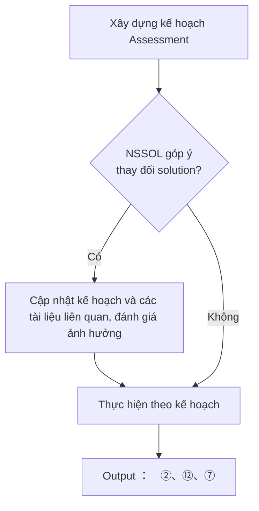

| Nội dung công việc                  | Input                                        | Output                                 | AI tham gia                                | Người làm          | Người review     | Bị block khi                           | Tiêu chí hoàn thành                                       |
| ----------------------------------- | -------------------------------------------- | -------------------------------------- | ------------------------------------------ | ------------------ | ---------------- | -------------------------------------- | --------------------------------------------------------- |
| Lập WBS, milestone và lịch review   | Proposal, timeline 5 tháng, danh sách output | WBS Assessment, milestone, lịch review | Có – tạo WBS/checklist bản nháp            | PM, TechLead-BrSE  | TechLead VN, PMO | Chưa rõ phạm vi hoặc ngày bắt đầu      | WBS có owner, thời hạn, dependency và mốc review          |
| Quản lý QA, issue, risk và decision | QA phát sinh, risk log, tiến độ thực tế      | QA list, issue/risk/decision log       | Có – tóm tắt, gom nhóm và cảnh báo overdue | PMO, TechLead-BrSE | PM, TechLead VN  | Không có owner hoặc NSSOL chưa trả lời | Mọi item có trạng thái, owner, deadline và hướng xử lý    |
| Báo cáo tiến độ                     | Actual effort, issue, output status          | Weekly report, action list             | Có – tổng hợp báo cáo nháp                 | PMO, PM            | TechLead-BrSE    | Dữ liệu tiến độ không được cập nhật    | Báo cáo phản ánh đúng tiến độ, vấn đề và action tiếp theo |

## A2. Tiếp nhận, kiểm kê và khóa Baseline

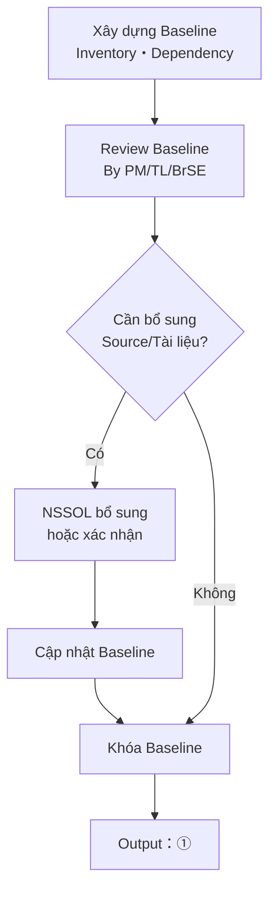

| Nội dung công việc            | Input                                                 | Output                                                       | AI tham gia                                 | Người làm                       | Người review                 | Bị block khi                                     | Tiêu chí hoàn thành                                          |
| ----------------------------- | ----------------------------------------------------- | ------------------------------------------------------------ | ------------------------------------------- | ------------------------------- | ---------------------------- | ------------------------------------------------ | ------------------------------------------------------------ |
| Tiếp nhận và kiểm tra dữ liệu | Source, BD/DD, DDL, shell, Makefile, JP1, file layout | Danh sách dữ liệu đã nhận và lỗi tiếp nhận                   | Có – phát hiện file lỗi/trùng/khác encoding | TechLead VN, AI Engineer        | BrSE, người quản lý tài liệu | File hỏng, thiếu quyền hoặc không rõ version     | Mỗi input có nguồn, ngày nhận, version và trạng thái sử dụng |
| Lập inventory                 | Toàn bộ source/tài liệu đã nhận                       | Danh sách subsystem, module, file, LOC, function             | Có – scan và thống kê tự động               | AI Engineer, Dev                | TechLead VN                  | Tool không đọc được file hoặc encoding sai       | Inventory có thể tái tạo và số liệu được kiểm tra mẫu        |
| Phân loại tài sản             | Inventory, source tree                                | Danh sách source thật, generated, duplicate, unused, unclear | Có – gợi ý phân loại                        | Dev, AI Engineer                | TechLead VN                  | Không xác định được nguồn gốc file               | Các file quan trọng đều có trạng thái và lý do phân loại     |
| Lập dependency map            | Include, function call, SQL, shell, JP1, tài liệu     | Mapping module–file–function–DB–IF–batch                     | Có – trích xuất dependency bản nháp         | AI Engineer, Dev, DB Specialist | TechLead VN                  | Thiếu source chung hoặc định nghĩa ngoài phạm vi | Dependency chính được truy vết và điểm chưa rõ được mở QA    |
| Khóa baseline                 | Inventory và QA đã xử lý                              | Baseline List phiên bản 1, missing-input list                | Không – con người quyết định                | TechLead VN, TechLead-BrSE      | NSSOL                        | Input trọng yếu chưa có hoặc scope chưa chốt     | Baseline có version, phạm vi in/out và lịch sử thay đổi      |

## A3. Đánh giá hệ thống hiện hành

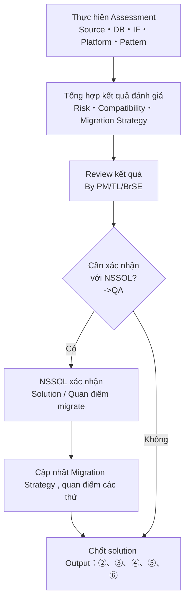

| Nội dung công việc                       | Input                                         | Output                                           | AI tham gia                                              | Người làm                            | Người review                        | Bị block khi                                                   | Tiêu chí hoàn thành                                            |
| ---------------------------------------- | --------------------------------------------- | ------------------------------------------------ | -------------------------------------------------------- | ------------------------------------ | ----------------------------------- | -------------------------------------------------------------- | -------------------------------------------------------------- |
| Phân tích cấu trúc và độ phức tạp source | Baseline source                               | Complexity report, A/B/C/D draft                 | Có – scan function, struct, global, macro, pointer, goto | TechLead VN, Senior Dev, AI Engineer | Senior Dev khác, TechLead-BrSE      | Source thiếu hoặc tool nhận diện sai nghiêm trọng              | Module/file/function trọng yếu được phân loại và có bằng chứng |
| Phân tích platform/build/runtime         | Makefile, compiler option, system call, shell | Platform impact report, build/runtime dependency | Có – tìm API/lệnh đặc thù OS                             | Senior Dev, Infra Engineer           | TechLead VN                         | Thiếu option build, library hoặc môi trường tham chiếu         | Mỗi dependency có phương án thay thế, QA hoặc risk             |
| Phân tích DB                             | Pro\*C, DDL, schema, SQL, privilege           | DB impact report, SQL/transaction mapping        | Có – trích xuất EXEC SQL và gom nhóm                     | DB Specialist, Senior Dev            | TechLead VN                         | Thiếu schema, synonym, privilege hoặc DB test                  | SQL/transaction quan trọng có hướng migrate và test point      |
| Phân tích interface/file                 | File layout, encoding, producer/consumer      | IF impact report, byte-compare list              | Có – phân tích layout và candidate mismatch              | Dev, Tester                          | TechLead VN, BrSE                   | Không có sample file hoặc expected output                      | Mỗi IF có format, encoding, dependency và cách kiểm chứng      |
| Phân tích batch/shell/JP1                | Shell, batch flow, JP1 definition             | Batch impact report, logic cần đưa vào BatchHost | Có – trích xuất env/error/retry/return code              | Senior Dev, Infra Engineer           | TechLead VN, BrSE                   | Thiếu shell hoặc thông tin vận hành thực tế                    | Xác định rõ shell bỏ, shell migrate và ảnh hưởng JP1           |
| Tổng hợp risk và incompatibility         | Kết quả các phân tích trên                    | Risk Map, incompatibility matrix draft           | Có – tổng hợp và xếp nhóm                                | TechLead VN                          | TechLead-BrSE, chuyên gia từng mảng | Finding chưa có bằng chứng hoặc mâu thuẫn giữa tài liệu/source | Mỗi risk có mức độ, ảnh hưởng, owner và đối sách/QA            |

## A4. Xây dựng AI knowledgebase

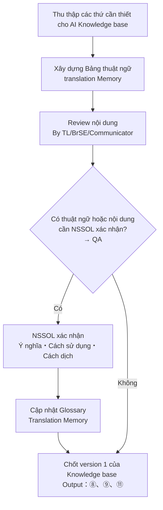

| Nội dung công việc                    | Input                                                       | Output                                             | AI tham gia                          | Người làm                 | Người review               | Bị block khi                                              | Tiêu chí hoàn thành                                                         |
| ------------------------------------- | ----------------------------------------------------------- | -------------------------------------------------- | ------------------------------------ | ------------------------- | -------------------------- | --------------------------------------------------------- | --------------------------------------------------------------------------- |
| Chuẩn hóa đơn vị tri thức và metadata | Source, tài liệu, QA, glossary                              | Quy tắc ID, tag, source reference, version, status | Có – đề xuất tag và liên kết         | AI Engineer               | TechLead VN, BrSE          | Chưa thống nhất cấu trúc metadata                         | Mỗi tri thức truy ngược được về nguồn và người review                       |
| Trích xuất và nạp Kho tri thức        | Baseline, tài liệu, kết quả Assessment                      | Knowledge Base phiên bản 1                         | Có – công việc chính của AI          | AI Engineer               | TechLead VN, Dev, BrSE     | Nguồn chưa được phép dùng hoặc chất lượng truy xuất thấp  | Kết quả tìm kiếm trả đúng nguồn và nội dung đã review                       |
| Xây dựng glossary Nhật–Việt–Anh       | Tài liệu, source comment, QA                                | Glossary, translation memory                       | Có – trích xuất và gợi ý dịch        | AI Engineer, Communicator | BrSE, người hiểu nghiệp vụ | Thuật ngữ chưa rõ ngữ cảnh                                | Thuật ngữ quan trọng có định nghĩa, ngữ cảnh và cách dùng thống nhất        |
| Gom nhóm candidate pattern            | Source sample, kết quả A/B/C/D                              | Pattern candidate list                             | Có – clustering và tìm đoạn tương tự | AI Engineer, Senior Dev   | TechLead VN                | Sample không đại diện hoặc thiếu behavior evidence        | Candidate có source mẫu, điều kiện nhận diện và nhóm xử lý                  |
| Định nghĩa migration rule             | Pattern candidate, target architecture, customer priorities | Pattern Catalog, Migration Rule draft              | Có – sinh mapping/sample draft       | Senior Dev, DB Specialist | TechLead VN, TechLead-BrSE | Chưa chốt kiến trúc hoặc behavior cần giữ                 | Mỗi rule có input condition, C# output, exception, review point, test point |
| Thử nghiệm và phê duyệt rule          | Source đại diện, rule draft                                 | Rule version được approve, exception list          | Có – chạy thử và so sánh             | Senior Dev, AI Engineer   | TechLead VN, TechLead-BrSE | Build fail, behavior không tương đương hoặc rule xung đột | Rule chạy lặp lại được, sample build/test pass và có version                |

## A5. Chuẩn hóa rule, quan điểm, pattern , quy tắc vv..

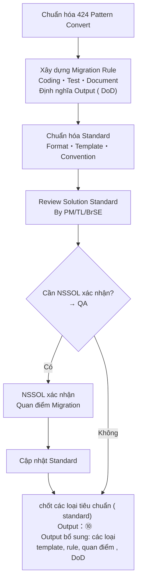

| Nội dung công việc                   | Input                                            | Output                                                          | AI tham gia                       | Người làm                         | Người review                       | Bị block khi                                                 | Tiêu chí hoàn thành                                                      |
| ------------------------------------ | ------------------------------------------------ | --------------------------------------------------------------- | --------------------------------- | --------------------------------- | ---------------------------------- | ------------------------------------------------------------ | ------------------------------------------------------------------------ |
| ------------------------------------ | ------------------------------------------------ | --------------------------------------------------------------- | --------------------------------- | --------------------------------- | ---------------------------------- | ------------------------------------------------------------ | ------------------------------------------------------------------------ |

## A6. Chuẩn bị kĩ thuật cho PoC

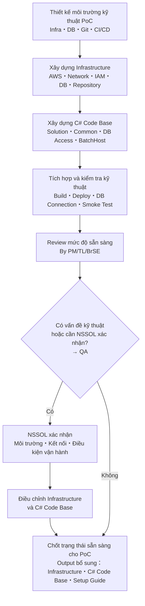

| Nội dung công việc                   | Input                                            | Output                                                          | AI tham gia                       | Người làm                         | Người review                       | Bị block khi                                                 | Tiêu chí hoàn thành                                                      |
| ------------------------------------ | ------------------------------------------------ | --------------------------------------------------------------- | --------------------------------- | --------------------------------- | ---------------------------------- | ------------------------------------------------------------ | ------------------------------------------------------------------------ |
| ------------------------------------ | ------------------------------------------------ | --------------------------------------------------------------- | --------------------------------- | --------------------------------- | ---------------------------------- | ------------------------------------------------------------ | ------------------------------------------------------------------------ |

## A7. Chuẩn bị kĩ thuật cho PoC

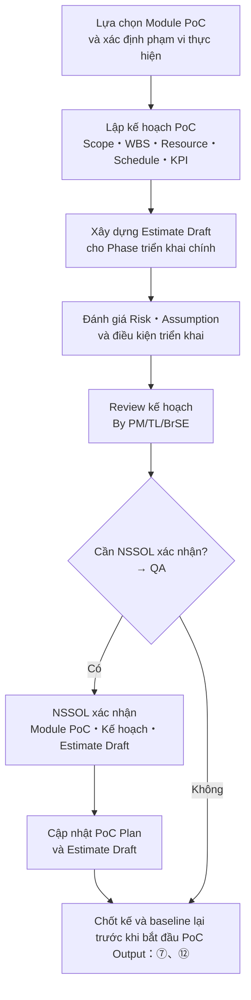

| Nội dung công việc                   | Input                                            | Output                                                          | AI tham gia                       | Người làm                         | Người review                       | Bị block khi                                                 | Tiêu chí hoàn thành                                                      |
| ------------------------------------ | ------------------------------------------------ | --------------------------------------------------------------- | --------------------------------- | --------------------------------- | ---------------------------------- | ------------------------------------------------------------ | ------------------------------------------------------------------------ |
| ------------------------------------ | ------------------------------------------------ | --------------------------------------------------------------- | --------------------------------- | --------------------------------- | ---------------------------------- | ------------------------------------------------------------ | ------------------------------------------------------------------------ |

---

# 4. Các luồng công việc giai đoạn PoC – Luồng HOW

Mục tiêu của PoC không phải là hoàn thành toàn bộ dự án, mà nhằm:

- Chứng minh Solution của Assessment có thể áp dụng vào thực tế.
- Chứng minh năng lực triển khai và quản lý của CMC.
- Đo lường năng suất thực tế để hiệu chỉnh Estimate cho Phase triển khai chính.
- Hoàn thiện quy trình Migration, Test và Update Design trước khi triển khai đại trà.

---

# P1. Phân tích Spec Module được lựa chọn

## Mục tiêu

Hiểu đầy đủ nghiệp vụ của module PoC, xác định phạm vi migrate, đầu vào/đầu ra, dữ liệu chuẩn và quan điểm test trước khi bắt đầu chuyển đổi.

## Workflow

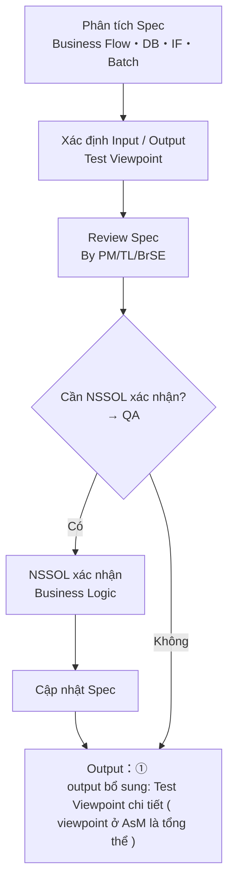

## Công việc

| Nội dung công việc                   | Input                                            | Output                                                          | AI tham gia                       | Người làm                         | Người review                       | Bị block khi                                                 | Tiêu chí hoàn thành                                                      |
| ------------------------------------ | ------------------------------------------------ | --------------------------------------------------------------- | --------------------------------- | --------------------------------- | ---------------------------------- | ------------------------------------------------------------ | ------------------------------------------------------------------------ |
| ------------------------------------ | ------------------------------------------------ | --------------------------------------------------------------- | --------------------------------- | --------------------------------- | ---------------------------------- | ------------------------------------------------------------ | ------------------------------------------------------------------------ |

| #   | Công việc                  | Output              |
| --- | -------------------------- | ------------------- |
| 1   | Đọc Source, BD, DD, DB, IF | Hiểu phạm vi module |
| 2   | Phân tích Business Flow    | Business Flow       |
| 3   | Xác định Input / Output    | Input Output Spec   |
| 4   | Xác định Test Viewpoint    | Test Viewpoint      |
| 5   | Review nội bộ              | Review Comment      |
| 6   | QA với NSSOL (nếu cần)     | QA Result           |
| 7   | Freeze Spec                | Spec Baseline       |

**Output**

- Input / Output Specification
- Test Viewpoint
- Business Flow

**DoD**

- Spec được hiểu thống nhất
- Không còn Issue mở ảnh hưởng đến Migration

---

# P2. AI Migrate → Human Review -> Source code migrated

## Mục tiêu

Thực hiện chuyển đổi source sang C#, kết hợp AI và con người để tạo Code Version 1.

## Workflow

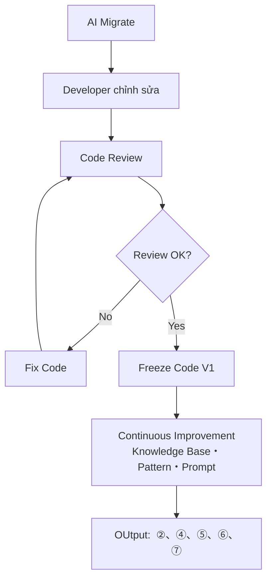

## Công việc

| Nội dung công việc                   | Input                                            | Output                                                          | AI tham gia                       | Người làm                         | Người review                       | Bị block khi                                                 | Tiêu chí hoàn thành                                                      |
| ------------------------------------ | ------------------------------------------------ | --------------------------------------------------------------- | --------------------------------- | --------------------------------- | ---------------------------------- | ------------------------------------------------------------ | ------------------------------------------------------------------------ |
| ------------------------------------ | ------------------------------------------------ | --------------------------------------------------------------- | --------------------------------- | --------------------------------- | ---------------------------------- | ------------------------------------------------------------ | ------------------------------------------------------------------------ |

| #   | Công việc                 | Output             |
| --- | ------------------------- | ------------------ |
| 1   | AI Rule-based Convert     | Source Draft       |
| 2   | AI Assisted Convert       | Source Draft       |
| 3   | Developer hoàn thiện Code | Source Update      |
| 4   | Áp dụng Migration Rule    | Migration Complete |
| 5   | Code Review               | Review Comment     |
| 6   | Fix Review Comment        | Source Final       |
| 7   | Build Verification        | Build Success      |
| 8   | Freeze Version 1          | Code Version 1     |

**Output**

- C# Version 1
- Migration Report
- Code Review Record

**DoD**

- Build thành công
- Review hoàn thành
- Đủ điều kiện chuyển sang TDD

---

# P3. Kiểm thử theo mô hình TDD (3 Round)

## Mục tiêu

Xác nhận Source C# đáp ứng yêu cầu kỹ thuật, nghiệp vụ và tương đương với hệ thống hiện hành.

## Workflow

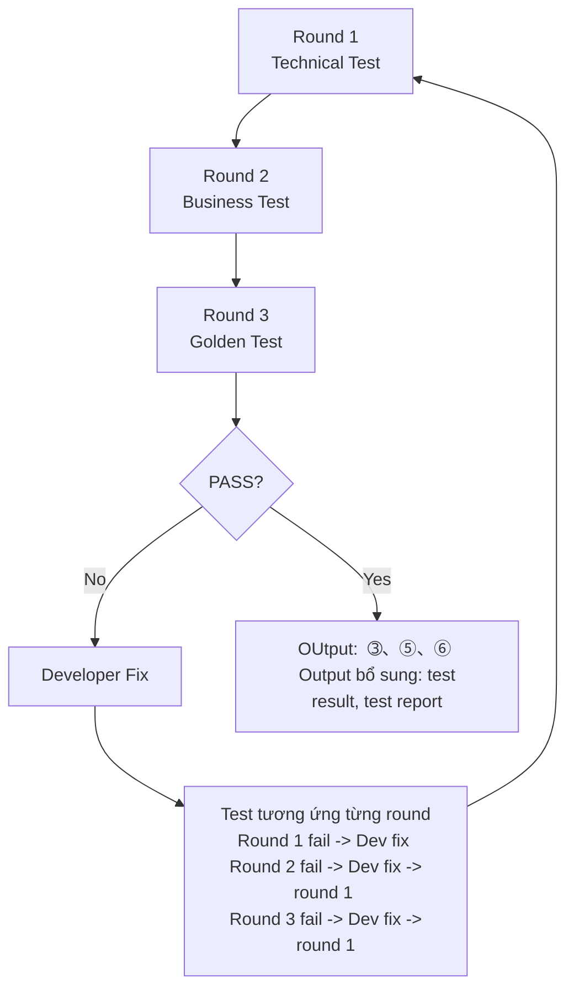

## Công việc

| Nội dung công việc                   | Input                                            | Output                                                          | AI tham gia                       | Người làm                         | Người review                       | Bị block khi                                                 | Tiêu chí hoàn thành                                                      |
| ------------------------------------ | ------------------------------------------------ | --------------------------------------------------------------- | --------------------------------- | --------------------------------- | ---------------------------------- | ------------------------------------------------------------ | ------------------------------------------------------------------------ |
| ------------------------------------ | ------------------------------------------------ | --------------------------------------------------------------- | --------------------------------- | --------------------------------- | ---------------------------------- | ------------------------------------------------------------ | ------------------------------------------------------------------------ |

| #   | Công việc            | Output               |
| --- | -------------------- | -------------------- |
| 1   | Technical Test       | Build Result         |
| 2   | Business Test        | Business Test Result |
| 3   | Golden Test          | Golden Report        |
| 4   | Phân tích Defect     | Issue List           |
| 5   | Developer Fix        | Updated Source       |
| 6   | Regression Test      | Regression Result    |
| 7   | Freeze Test Evidence | Test Report          |

**Output**

- Test Report
- Coverage Report
- Golden Test Result
- Defect List

**DoD**

- 3 Round PASS
- Không còn Critical Issue
- Golden Test đạt tiêu chí

---

# P4. NSSOL Review & Verification

## Mục tiêu

NSSOL thực hiện review và xác nhận độc lập trên môi trường Staging.

## Workflow

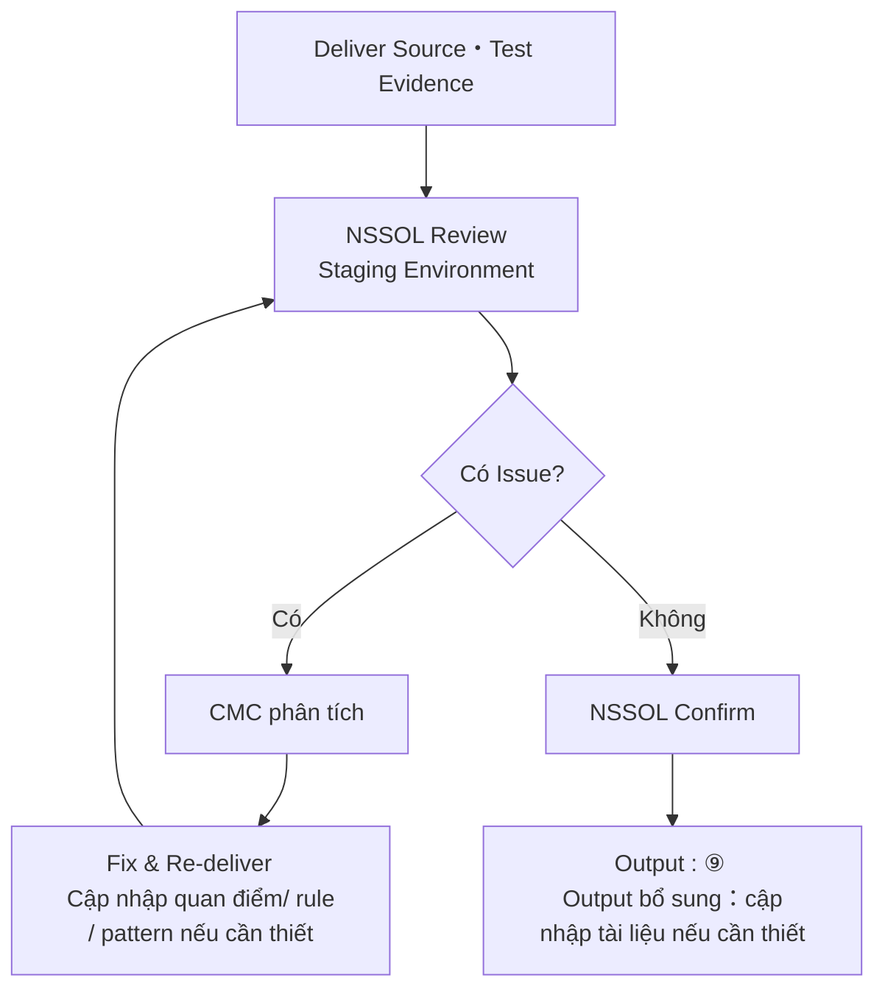

## Công việc

| Nội dung công việc                   | Input                                            | Output                                                          | AI tham gia                       | Người làm                         | Người review                       | Bị block khi                                                 | Tiêu chí hoàn thành                                                      |
| ------------------------------------ | ------------------------------------------------ | --------------------------------------------------------------- | --------------------------------- | --------------------------------- | ---------------------------------- | ------------------------------------------------------------ | ------------------------------------------------------------------------ |
| ------------------------------------ | ------------------------------------------------ | --------------------------------------------------------------- | --------------------------------- | --------------------------------- | ---------------------------------- | ------------------------------------------------------------ | ------------------------------------------------------------------------ |

| #   | Công việc             | Output              |
| --- | --------------------- | ------------------- |
| 1   | Deliver Source        | Delivery Package    |
| 2   | Deliver Test Evidence | Evidence            |
| 3   | NSSOL Review          | Review Comment      |
| 4   | CMC Phân tích         | Issue Analysis      |
| 5   | Fix                   | Updated Package     |
| 6   | Re-Deliver            | Delivery Package V2 |
| 7   | NSSOL Confirm         | Review Result       |

**Output**

- NSSOL Review Result
- Approved Source

**DoD**

- NSSOL xác nhận hoàn thành
- Không còn Issue Major

---

# P5. Cập nhật Design & Deliver & Báo cáo

## Mục tiêu

Hoàn thiện toàn bộ tài liệu và báo cáo PoC, chuẩn bị Deliver cho giai đoạn triển khai chính.

## Workflow

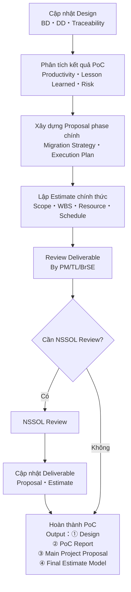

## Công việc

| Nội dung công việc                   | Input                                            | Output                                                          | AI tham gia                       | Người làm                         | Người review                       | Bị block khi                                                 | Tiêu chí hoàn thành                                                      |
| ------------------------------------ | ------------------------------------------------ | --------------------------------------------------------------- | --------------------------------- | --------------------------------- | ---------------------------------- | ------------------------------------------------------------ | ------------------------------------------------------------------------ |
| ------------------------------------ | ------------------------------------------------ | --------------------------------------------------------------- | --------------------------------- | --------------------------------- | ---------------------------------- | ------------------------------------------------------------ | ------------------------------------------------------------------------ |

| #   | Công việc               | Output                 |
| --- | ----------------------- | ---------------------- |
| 1   | Cập nhật BD/DD          | Design Document        |
| 2   | Cập nhật Traceability   | Traceability Matrix    |
| 3   | Tổng hợp Productivity   | Productivity Report    |
| 4   | Tổng hợp Lesson Learned | Lesson Learned         |
| 5   | Review Deliverable      | Review Comment         |
| 6   | NSSOL Review            | Review Result          |
| 7   | Hoàn thiện Deliver      | Final Delivery Package |

**Output**

- Design Document
- Traceability Matrix
- Productivity Report
- Lesson Learned
- Final Delivery Package

**DoD**

- Tài liệu hoàn chỉnh
- Deliverable được NSSOL chấp nhận
- Kết thúc PoC
